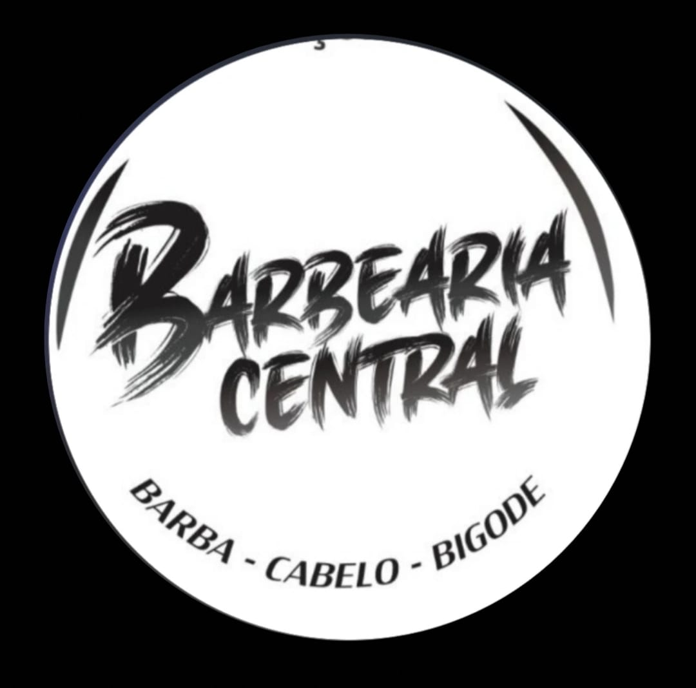
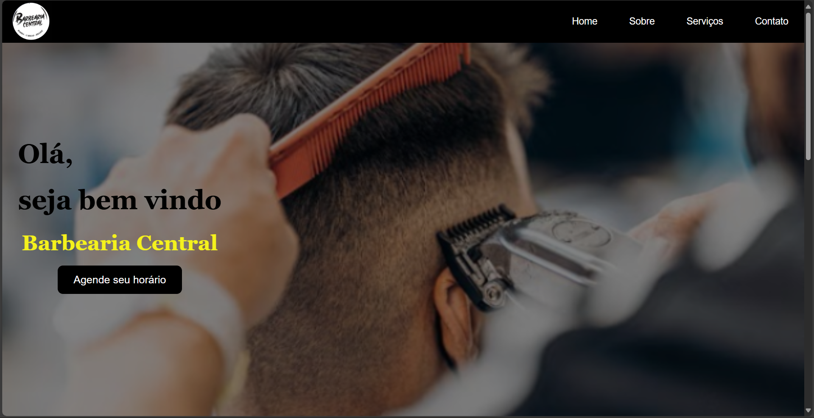
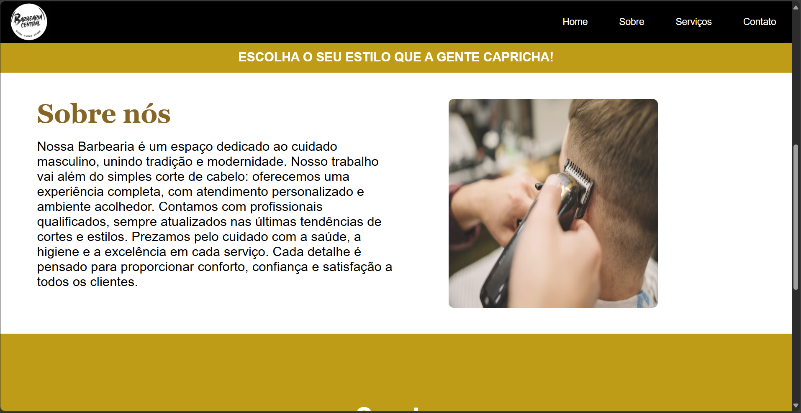
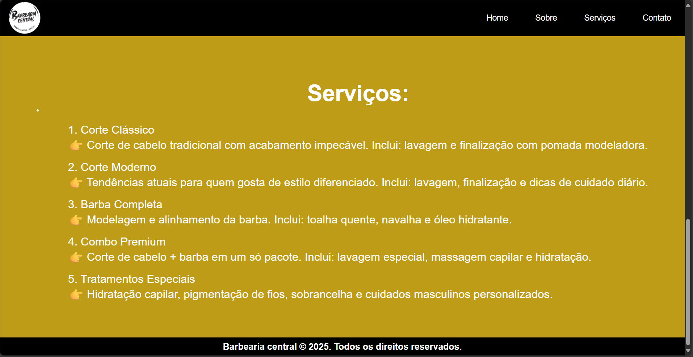

# Barbearia central



Um site da barbearia central desenvolvido para melhorar sua experiência com os clientes.

## Indice
 Tecnologias utilizadas:
- HTML5
- CSS
- Java script
- REACT JS

## Funcionalidades do projeto:

- [x] Menu
- [x] Main
- [x] Sobre
- [x] Serviços






## Demonstração:


...
1. Clone este repositório:
   ```bash
    git clone https://https://github.com/Pedroita-057/Projeto.git
...
## Pessoas Autoras
 


